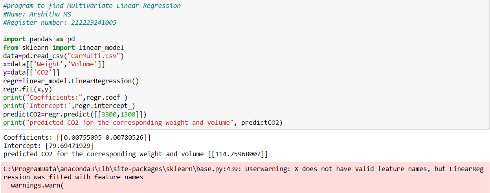

# Implementation of Multivariate Linear Regression
## Aim
To write a python program to implement multivariate linear regression and predict the output.
## Equipment’s required:
1.	Hardware – PCs
2.	Anaconda – Python 3.7 Installation / Moodle-Code Runner
## Algorithm:
### Step1
Import pandas ad pd

### Step2
Import Linear_model from sklearn.

### Step3
Read the csv file using pandas library.
### Step4
Enter the parameters of the linear function.

### Step5
Print the parameters of the linear function.

## Program:
```
#program to find Multivariate Linear Regression
#Name: Arshitha MS
#Register number: 212223241005

import pandas as pd
from sklearn import linear_model
data=pd.read_csv("CarMulti.csv")
x=data[['Weight','Volume']]
y=data[['CO2']]
regr=linear_model.LinearRegression()
regr.fit(x,y)
print("Coefficients:",regr.coef_)
print('Intercept:',regr.intercept_)
predictCO2=regr.predict([[3300,1300]])
print("predicted CO2 for the corresponding weight and volume", predictCO2)
```
## Output:



## Result
Thus the multivariate linear regression is implemented and predicted the output using python program.
